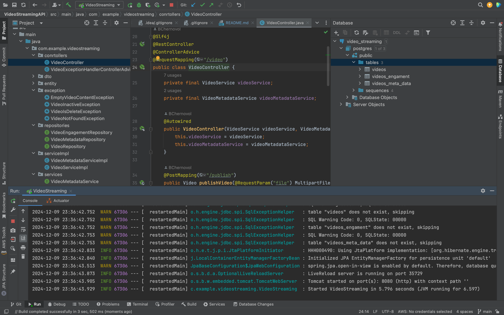
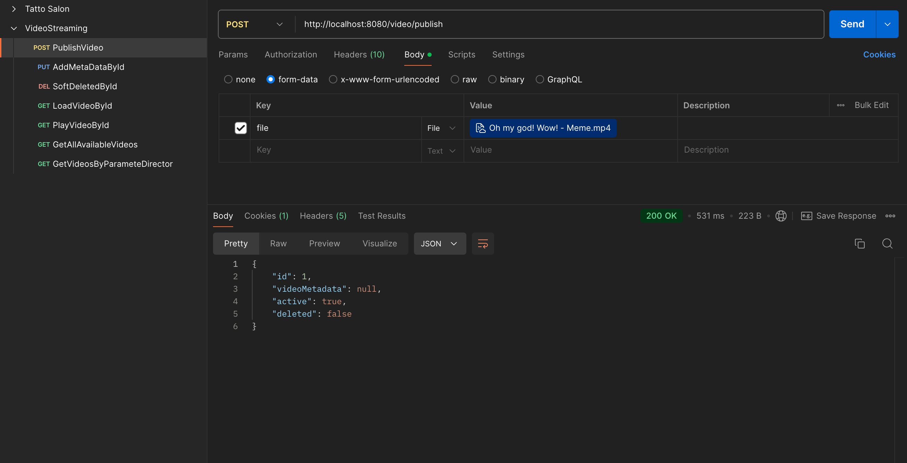
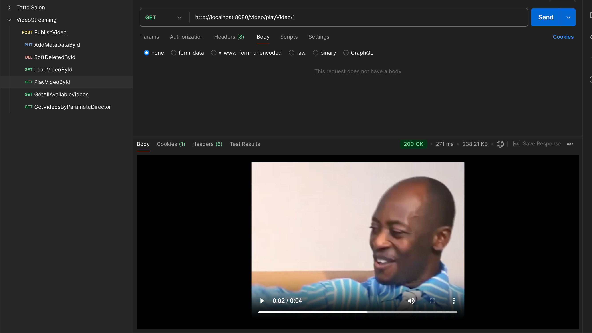

# VideoStreamingAPI

## Overview
VideoStreamingAPI is a video streaming service built with Spring Boot. It supports various video management functionalities including publishing, updating metadata, soft deleting, and more.

## Technologies Used
- **Spring Boot**: Web framework for building the RESTful API.
- **PostgreSQL**: Local database for storing video data.
- **JPA**: Used for interacting with the database.
- **Hibernate**: Used for creating entity in DB
- **Lombok**: For generating constructors, getters, setters, etc.

## Setup

### Prerequisites
Before running the project, make sure you have the following installed:
- Java 17 or higher
- PostgreSQL

### Database Configuration
1. PostgreSQL should be installed and running locally.
2. Create a database named `video_streaming` in PostgreSQL (or use any name you prefer).
3. Use the following credentials for the database:
    - Username: `postgres`
    - Password: `postgres`

### Application Configuration
The application is configured to connect to the PostgreSQL database using the default credentials. Ensure your `application.properties` contains the following:

```properties
spring.datasource.driverClassName=org.postgresql.Driver
spring.datasource.url=jdbc:postgresql://localhost:5432/postgres?useSSL=false
spring.datasource.username=postgres
spring.datasource.password=postgres

spring.jpa.hibernate.ddl-auto=create-drop
```

# Running the Application
To run the application, execute the following command:

```bash
mvn spring-boot:run
```

The application will be available on [http://localhost:8080](http://localhost:8080).

# API Endpoints

## Video Endpoints

### 1. Publish Video
- **URL:** `http://localhost:8080/video/publish`
- **Method:** `POST`
- **Description:** Publishes a new video to the platform.

### 2. Update Video Metadata
- **URL:** `http://localhost:8080/video/updateMetadata/{id}`
- **Method:** `PUT`
- **Description:** Updates the metadata of an existing video by ID.
- **URL Example:** `http://localhost:8080/video/updateMetadata/1`

### 3. Soft Delete Video
- **URL:** `http://localhost:8080/video/softDeleteVideo/{id}`
- **Method:** `DELETE`
- **Description:** Soft deletes a video by ID (marks it as deleted without removing it from the database).
- **URL Example:** `http://localhost:8080/video/softDeleteVideo/3`

### 4. Load Video
- **URL:** `http://localhost:8080/video/loadVideo/{id}`
- **Method:** `GET`
- **Description:** Loads the video content by ID.
- **URL Example:** `http://localhost:8080/video/loadVideo/1`

### 5. Play Video
- **URL:** `http://localhost:8080/video/playVideo/{id}`
- **Method:** `GET`
- **Description:** Plays the video by ID.
- **URL Example:** `http://localhost:8080/video/playVideo/1`

### 6. Get All Available Videos
- **URL:** `http://localhost:8080/video/getAllAvailableVideos`
- **Method:** `GET`
- **Description:** Retrieves a list of all available videos.

### 7. Get Video by Director
- **URL:** `http://localhost:8080/video/getVideoByDirector/{directorName}`
- **Method:** `GET`
- **Description:** Retrieves a list of videos by a specific director.
- **URL Example:** `http://localhost:8080/video/getVideoByDirector/Borys Chernovol`

# Postman Collection

For easy testing of the API, a Postman collection and sample content are included in the resources folder.

- **Postman Collection:** The collection contains all the API endpoints defined above and can be imported into Postman for quick testing.
- **Sample Content:** The resources folder also contains sample JSON data for use in testing the API.

## How to Use Postman Collection:
1. Open Postman.
2. Import the collection by clicking on the "Import" button.
3. Select the `VideoStreamingAPI.postman_collection.json` file from the resources folder.
4. Use the predefined API requests to test the service.

## Results




